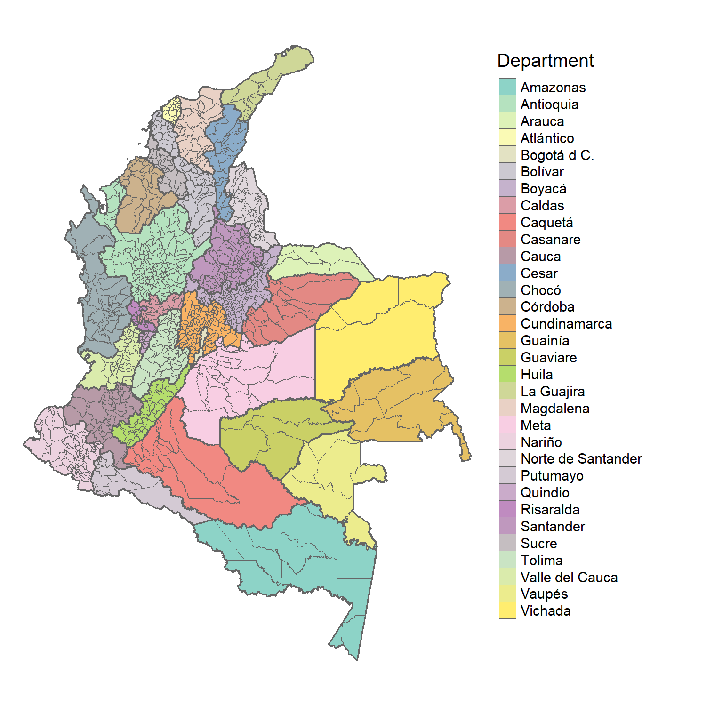
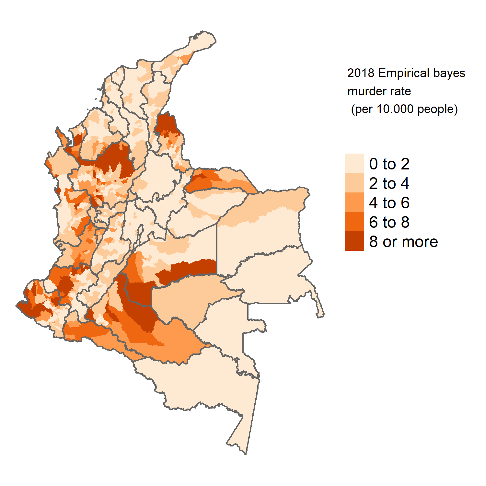
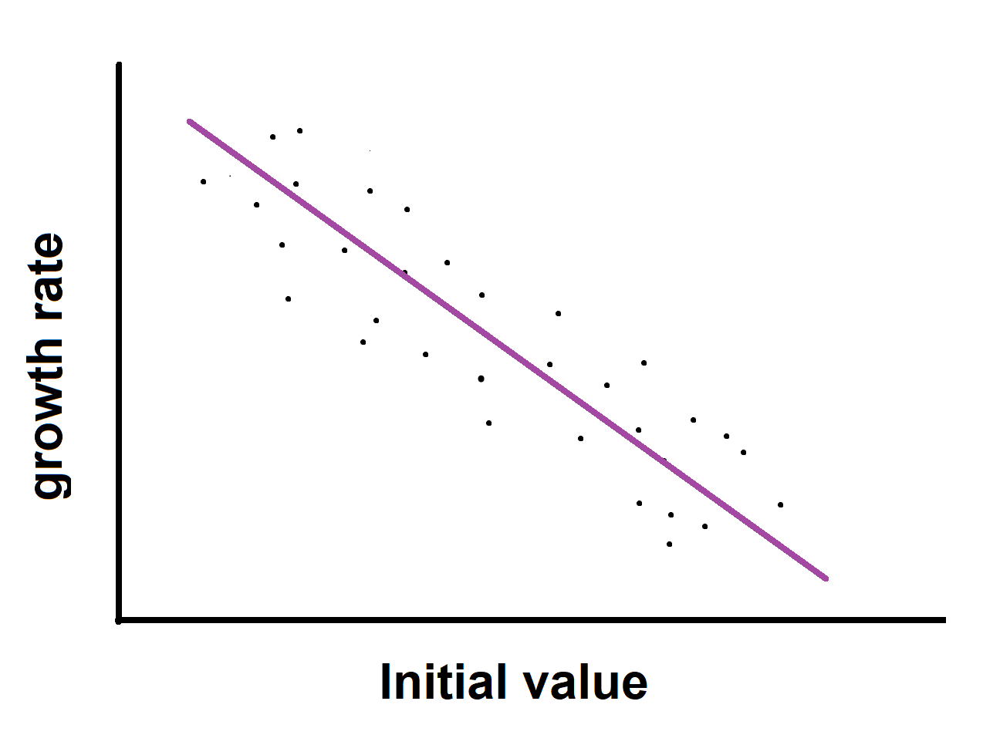
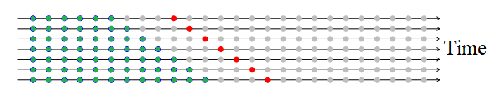
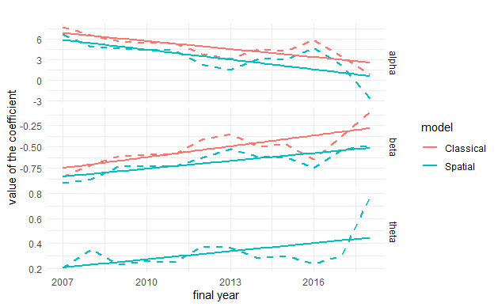
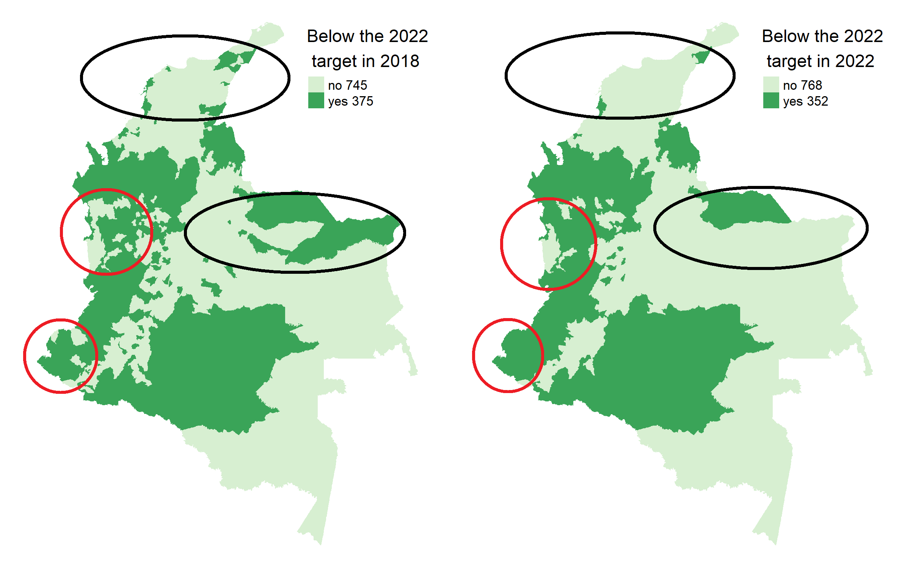
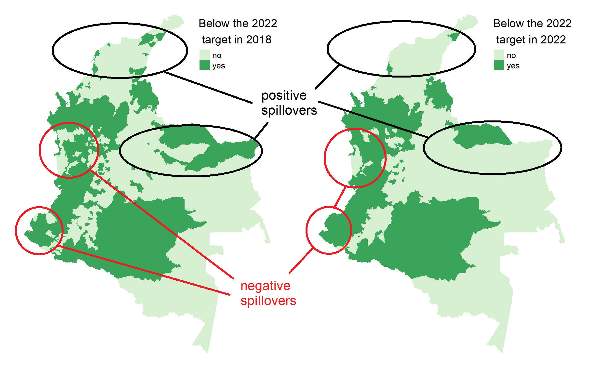
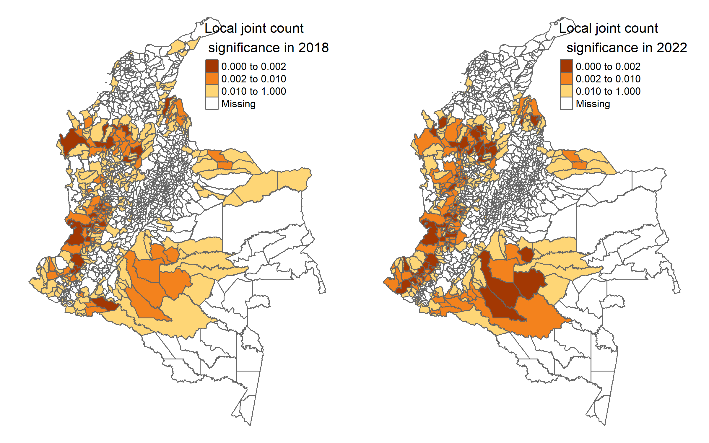
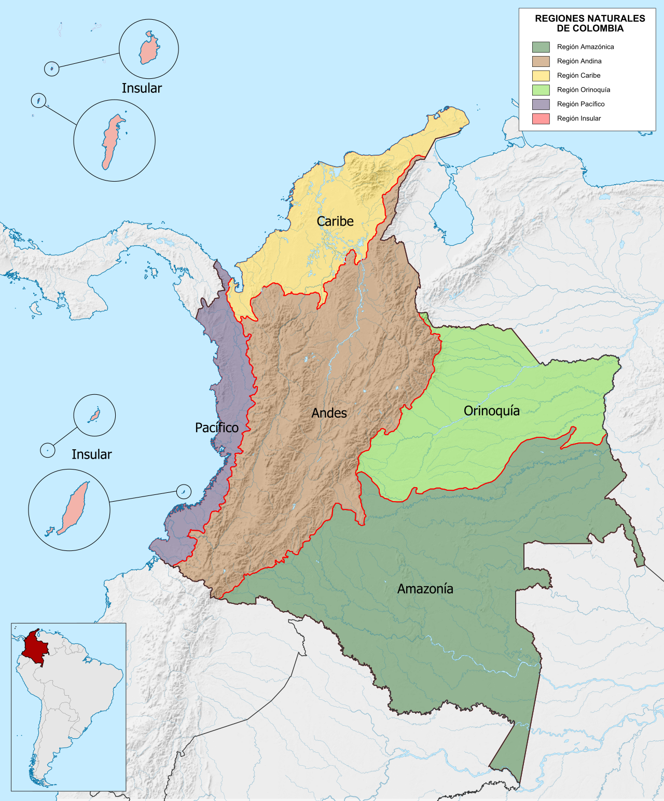

```{r setup, include=FALSE}
library(xaringan)
options(htmltools.dir.version = FALSE)
```

## Motivation:

- Policy development and management should consider not only current challenges but also **the potential challenges in the near future**.

- Persistent income differences, differences in health indicators and in "general" regional inequality in Colombia.

- Scarce academic literature on the **forecasting of crime** at the municipal level in Colombia. 


## Research Objective:
  
- **To build a forecasting model that can predict homicide rates 4 years into the future**

- Analyze the spatial distribution of the forecasted homicide rates in 2022

## Methods:

- Exponential smoothing
- ARIMA models
- STAR models
- **Classical convergence framework (Barro and Sala-i-Martin 1992)**

---

class: middle

# Main Results:

1. **Beta and Spatial-beta forecasting models** are more accurate than other conventional forecasting models.

2. **768 out of 1120** Colombian municipalities are expected to reach the 2022 national SDG target.

3. **Increasing spatial polarization of the data**. higher crime areas are more likely to be surrounded by high crime areas and conversely for low-low cluster formation. 
  

---

class: middle

# Outline of this presentation

1. **Data description** administrative levels in Colombia and homicide rates.

3. **Forecasting models** 

  - Exponential smoothing, ARIMA and STAR models

2. **Beta convergence models**

  - Beta convergence and forecasting

4. **Main results and prediction:**

  - Best models and forecasted data
  
5. **Policy discussion**

  - The Colombian National Development Plan
 2018-22  
  
5. **Concluding Remarks**
  
---
# Colombian administrative levels and the spatial distribution of crime 

.pull-left[ ## States and Municipalities


]

.pull-right[
## Crime

]

---

# Data:

- Total number of **homicides** and in Colombia per year from 2003 until 2018 (**data taken from Municipal data-set Universidad de los Andes, Bogota, Colombia**).

- Data is aggregated at the municipal and departmental levels.

- Population census and estimates for states and municipalities (data from the same dataset).

- Raw rates computed $$raw\space rates = crimes / population$$

- Non crime rates  computed　
   $$NCR= 10000- raw\ rate * 10000$$
- **Survival rates** are chosen because positively defined variables are a **standard** in the convergence literature.

-The variables are transformed from raw rates to Empirical Bayes rates in order to control for variance instability.

---
class: center
# Global trend of crime


---
class: middle 

# Exponential smoothing methods

In general terms, these methods use a **weighted
average of past observations** in order to draw a forecast of future observations

$$\hat{y}_{T+1 \mid T}=\alpha y_{T}+\alpha(1-\alpha) y_{T-1}+\alpha(1-\alpha)^{2} y_{T-2}+\cdots$$

# ARIMA models

An autoregressive model of order p

$$y_{t}=c+\phi_{1} y_{t-1}+\phi_{2} y_{t-2}+\cdots+\phi_{p} y_{t-p}+\varepsilon_{t}$$
A moving average model considers past forecast
errors in a linear model:

$$y_{t}=c+\varepsilon_{t}+\theta_{1} \varepsilon_{t-1}+\theta_{2} \varepsilon_{t-2}+\cdots+\theta_{q} \varepsilon_{t-q}$$
An autoregressive model, a moving average model and the differentiating of the data can be combined into a non-seasonal ARIMA model:

$$y_{t}^{\prime}=c+\phi_{1} y_{t-1}^{\prime}+\cdots+\phi_{p} y_{t-p}^{\prime}+\theta_{1} \varepsilon_{t-1}+\cdots \theta_{q} \varepsilon_{t-q}+\varepsilon_{t}$$
---
class: middle
# Space time Autoregressive models (STAR)

$$y_{i t}=\sum_{k=1}^{p} \sum_{l=0}^{\lambda_{k}} \phi_{k l} \sum_{j=1}^{N} w_{i j}^{(l)} y_{j t-k}+a_{i t}$$

- $y_it$ is the variable of interest at location $i$ during time $t$
- $a_{it}$ is the random normal error associated with that location and time. 
- $y_{jt-k}$ are the
time lagged variables at location $j$ 
- $w_{i j}^{(l)}$ is the distance weight matrix of
order (l).


These models have been **successfully used to forecast crime data in the United States**. 
See Shoesmith GL (2013) Space-time autoregressive models and forecasting
national, regional and state crime rates.

---
class: center

# **Beta convergence and forecasting** (catch-up process)  



When studying regional data sets, Barro and Sala-i
Martin (1995) proposes the following equation:

      
$$(1 / T) \cdot \log \frac{y_{i T}}{y_{i 0}}=\alpha-\left[1-e^{-\beta T}\right] \cdot \log \left(y_{i 0}\right)+w_{i, 0 T}$$

Solving the equation for $y_{i T}$: 
$$(1 / T) \cdot \log \left(y_{i T}\right)=\alpha+e^{-\beta T} \cdot \log \left(y_{i 0}\right)+w_{i, 0 T}$$
Therefore, a plausible 4-year ahead forecast is:

$$\log \left(\hat{y}_{i(t+4) \mid t}\right)=\hat{\alpha}_{t+4 \mid t}+\hat{\beta}_{t+4 \mid t} \cdot \log \left(y_{i t}\right)+w_{i, t}$$

---
class: middle, justify

#**Spatial Beta convergence model**

- Spatial beta convergence models have been used to model the dynamics of crime **(Santos-Marquez and Mendez, 2020)**
- In order to simplify the computations instead of a SAR
(spatial autoregressive model) or a SEM (spatial error model), **an SLX model
(Spatially Lagged X) is proposed to forecast homicide**.
- the spatial equivalent
of the equation in the previous slide is:

$$(1 / T) \cdot \log \frac{y_{i T}}{y_{i 0}}=\alpha-\left[1-e^{-\beta T}\right] \cdot \log \left(y_{i 0}\right)+\theta W \cdot \log \left(y_{i 0}\right)+\epsilon_{i, 0 T}$$
Therefore, a plausible 4-year ahead forecast is:

$$\log \left(\hat{y}_{i(t+4) \mid t}\right)=\hat{\alpha}_{t+4 \mid t}+\hat{\beta}_{t+4 \mid t} \cdot \log \left(y_{i t}\right)+\hat{\theta}_{t+4 \mid t} W \cdot \log \left(y_{i t}\right)+\epsilon_{i, t}$$
Where three coefficients need to be computed: $\alpha$, $\beta$ and $\theta$.

---
class: middle, center

# Time series forecast accuracy and cross-validation

#How can the best forecasting model be chosen?

$$\begin{aligned}
&\text { Mean absolute error: } \operatorname{MAE}=\operatorname{mean}\left(\left|e_{t}\right|\right)\\
&\text { Root mean squared error: RMSE }=\sqrt{\operatorname{mean}\left(e_{t}^{2}\right)}
\end{aligned}$$
# Cross-validation of forecasts



---

class: center, middle

# The prediction of the coefficients of the beta models



Linear regressions are used to compute the coefficients in:

$$\log \left(\hat{y}_{i(t+4) \mid t}\right)=\hat{\alpha}_{t+4 \mid t}+\hat{\beta}_{t+4 \mid t} \cdot \log \left(y_{i t}\right)+\hat{\theta}_{t+4 \mid t} W \cdot \log \left(y_{i t}\right)+\epsilon_{i, t}$$
$$\log \left(\hat{y}_{i(t+4) \mid t}\right)=\hat{\alpha}_{t+4 \mid t}+\hat{\beta}_{t+4 \mid t} \cdot \log \left(y_{i t}\right)+w_{i, t}$$
---

class: center, middle

# Cross-validation results (Beta and spatial Beta)


---
class: justify
# Forecasting homicide rates for 2022

- In the Colombian National Development Plan 2018-2022 DNP (2018) there are national targets for a variety of SDG related variables for the year 2022.
- In terms of homicides the baseline for 2018 is 2.58(per 10.000 people) and
the **2022 target is 2.32 per 10.000 people (nmr= 9997.68)**


---
class: center
# Forecasting homicide rates for 2022
# (2022 Target = 9997.68)


**A noticeable error in this forecasting model is the fact that a total of 68 municipalities have a predicted non crime rate slightly above 10000 (WHICH IS PRACTICALLY IMPOSSIBLE)**
---
class: center
## The spatial distribution of the forecasted crime
**municipalities in dark green are lagging behind**



---
class: center
## The spatial distribution of the forecasted crime
**municipalities in dark green are lagging behind**



---
class: center
# Measuring the polarization of regional crime 
## Local join count statistic (Anselin (1995), Anselin and Li (2019))


---
# Policy discussion 

.pull-left[ 
- Vertical and horizontal policy coordination, spillovers and borders.

- Spatial spillovers from neighbors can have **both positive and negative effects**.

- It could be more appropriate for the formulation of development plans to have targets at the **state level or regional level**.

- For example, there is a clear negative spill-over in the municipalities in **the pacific region (in purple)**.

]

.pull-right[
## Colombian natural regions

]


---

# Concluding Remarks

## Uplifting results "on average" :

- The dispersion of non-crime (crime) rates at the state level **has decreased**. 

- It was found that the forecasted mean in 2022
is still below the 2022 target. 

- Nevertheless, major improvements are foreseen
as 23 extra municipalities are expected to reach the SDG homicide target by 2022. This will bring the total of municipalities that have accomplished the
target to 768 out of 1120 in 2022.

## The Role of Space

- There are **positive and negative spillovers**.

- **Policy should be localized in order to reverse the creation of crime clusters**.

## Further Research 

- **Other determinants** may help to improve the forecasting accuracy of the beta models.
- A **damped trend method** may help to correct for municipalities that are forecasted to have 0.0 crime rates
---
class: center, middle

# Thank you very much for your attention

 You can find more about my research outputs on my website https://felipe-santos.rbind.io

If you are interested in our research please check the  QuaRCS lab website <br />

https://quarcs-lab.org/

 

**Quantitative Regional and Computational Science Lab**


